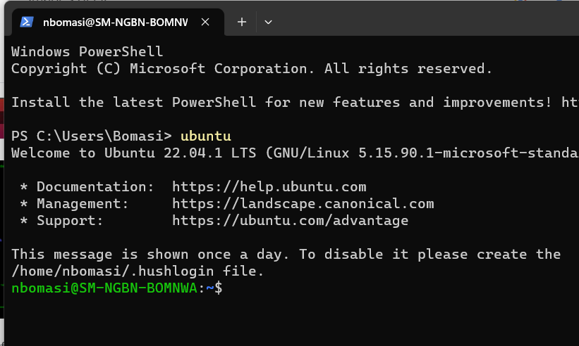
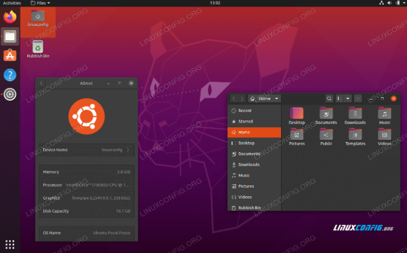
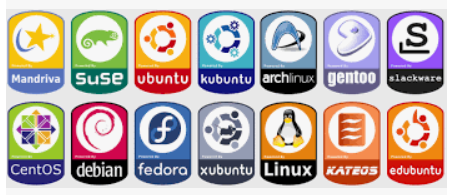

# Module 1: Introduction to Linux Operating System

## Brief history and development of Linux.

* **Unix** is a family of operating systems that originated in the 1970s at Bell Labs. It was developed by a group of researchers, including Ken Thompson and Dennis Ritchie, who sought to create an operating system that provided a powerful and flexible environment for computing.

* Key characteristics of Unix include: Multitasking, Multiuser, Hierarchical File System, Command-Line Interface (CLI), Portability, Modularity and Reusability, Networking and Interoperability, 

 * **Multitasking:** Unix allows multiple tasks or processes to run concurrently, enabling efficient utilization of system resources.
 * **Multiuser:** Unix supports multiple users accessing the system simultaneously, each with their own account and privileges.
 * **Hierarchical File System:** Unix organizes files and directories in a hierarchical structure. This provides a logical and organized way to manage data and resources.
 * **Command-Line Interface (CLI):** Unix primarily employs a command-line interface, where users interact with the system by typing commands and receiving textual output. This allows for powerful scripting and automation capabilities.
 * **Portability:** Unix was designed to be portable across different hardware architectures. This design philosophy enabled Unix to be adapted to various computer systems and led to its widespread use and availability on different platforms.
 * **Modularity and Reusability:** Unix follows a modular design approach, where components are developed as small, self-contained programs that can be combined to perform complex tasks. This promotes code reusability and allows for easy extension and customization.
 * **Networking and Interoperability:** Unix has built-in support for networking protocols, making it well-suited for networked environments. It provides tools and services for communication, file sharing, and remote access.
You can learn more details [here](https://www.britannica.com/technology/Linux)

**OS kernel:** The operating system (OS) kernel is a fundamental component of an operating system. It serves as the core or central part of the OS, responsible for managing system resources, providing essential services, and acting as an interface between software applications and the underlying hardware.

* In 1991 Linus Torvalds, a Finnish computer science student, developed the Linux kernel as an open-source project. Torvalds sought to create a Unix-like operating system for personal computers.

* Linux gained popularity in the 1990s due to its stability, scalability, and cost-effectiveness. As more developers joined the project, the Linux community expanded, driving innovation and enhancing the system's capabilities.

## What is Linux

Linux is a powerful and versatile family of open-source Unix operating systems based on the Linux Kernel, It is just like Windows, macOS that you are very family with, except that is an open-source OS. 

As we continue we will understand why Linux is more versatile in the application development world as compared to other OS.

When working with Linux, you interact with the operating system through a shell. A shell is a program that provides access to various services and functionality of the Linux system, in another it allows you to interact with the OS, without shell, the OS is as good as read only document in your computer. We have Linux that offer a graphical user interface (GUI), just like windows and macOS,  using the command-line interface (CLI) offers more control and efficiency.

While the GUI is user-friendly, it often requires multiple steps to accomplish tasks. In contrast, the CLI allows you to execute commands quickly, automate tasks, and perform complex operations with ease. By learning common Linux commands, you can harness the full potential of the system.

## What is a Linux Command?

A Linux command refers to a program or utility that runs in the command-line interface (CLI). The CLI is a text-based environment where you interact with the system by typing commands. It is similar to the Command Prompt in Windows or powershell.

Linux commands are executed by entering them in the Terminal and pressing Enter. These commands enable you to perform a wide range of tasks, including installing packages, managing users, manipulating files and directories, configuring system settings, and more.
The general syntax of a Linux command is as follows:
CommandName [option(s)] [parameter(s)]
A command may consist of options and parameters, but they are not always required.

Here are the key components of a command:
**CommandName:** This represents the action or task you want to perform using the command. 
**Option or Flag:** An option modifies the behavior of a command. It is typically preceded by a hyphen (-) or double hyphen (--) and can be used to customize the command's functionality. 
**Parameter or Argument:** A parameter provides specific information or data required by the command to execute the desired action. It's important to note that Linux commands are case-sensitive, so you need to enter them exactly as they are spelled and formatted. We will go in details as the course continues
By familiarizing yourself with Linux commands, you gain the ability to efficiently navigate and manage the system, automate tasks, and unleash the full potential of Linux for your needs.

Keep in mind that all Linux commands are case-sensitive, this means when you save a file with the name “boma”, it is not the same as “Boma”

## Understanding Linux distributions.

Since Linux is an open source software, various organization can buy the licence then package and twick it to their desire, these packages are call Linux distributions or distros. Some can commercialize theirs.

Linux  distros emerged to package the Linux kernel with various software and tools. Examples include **Debian**, **Red Hat**, and **Ubuntu.** 
Linux distributions provide users with a choice of operating systems built around the Linux kernel, offering flexibility, freedom, and the ability to customize the computing environment to suit individual preferences and requirements.
For more details [visit](https://en.wikipedia.org/wiki/Linux_distribution) 

