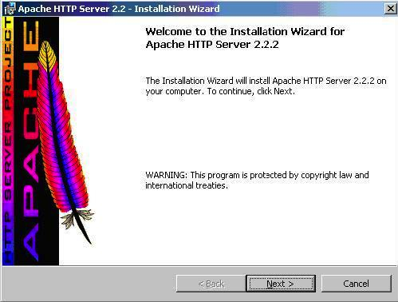

## Introduction to Linux

Linux is a powerful and versatile family of open-source Unix operating systems based on the Linux Kernel. It includes popular distributions like Ubuntu, Fedora, Debian, openSUSE, and Red Hat. Many users choose Linux for managing Virtual Private Servers (VPS) due to its reliability and flexibility.

When working with Linux, you interact with the operating system through a shell. A shell is a program that provides access to various services and functionality of the Linux system. While most Linux distributions offer a graphical user interface (GUI), using the command-line interface (CLI) offers more control and efficiency.

While the GUI is user-friendly, it often requires multiple steps to accomplish tasks. In contrast, the CLI allows you to execute commands quickly, automate tasks, and perform complex operations with ease. By learning common Linux commands, you can harness the full potential of the system.

## What is a Linux Command?
A Linux command refers to a program or utility that runs in the command-line interface (CLI). The CLI is a text-based environment where you interact with the system by typing commands. It is similar to the Command Prompt in Windows.

Linux commands are executed by entering them in the Terminal and pressing Enter. These commands enable you to perform a wide range of tasks, including installing packages, managing users, manipulating files and directories, configuring system settings, and more.

The general syntax of a Linux command is as follows:

CommandName [option(s)] [parameter(s)]

A command may consist of options and parameters, but they are not always required. Here are the key components of a command:

**CommandName:** This represents the action or task you want to perform using the command.
**Option or Flag:** An option modifies the behavior of a command. It is typically preceded by a hyphen (-) or double hyphen (--) and can be used to customize the command's functionality.
**Parameter or Argument:** A parameter provides specific information or data required by the command to execute the desired action.
It's important to note that Linux commands are case-sensitive, so you need to enter them exactly as they are spelled and formatted.

By familiarizing yourself with Linux commands, you gain the ability to efficiently navigate and manage the system, automate tasks, and unleash the full potential of Linux for your needs.

**Keep in mind that all Linux commands are case-sensitive**

#### Lets start working on the command line by learning how to install different softwares

🔧 **Pre-requisites:**
- You already have a Linux terminal. This could either be that you connected to a remote server over **SSH**, or you are on a Windows laptop using **Windows Subsystem For Linux (WSL)**

🔍 **NOTE:**

- If you use a Macbook, you can open up a terminal and run most of the commands. But some of them may not work. So it is important that you use your Mac terminal as a client tool to connect to a remote server over **SSH**

## Package Managers

Installing software on computer systems is a common practice that you will find yourself doing a lot of the time. Whether you are looking to add new applications, libraries, or tools to enhance your computer's functionality, it's essential to have a streamlined and efficient way to manage these installations. This is where package managers come into play.

Package managers are powerful tools that simplify the process of installing, updating, and removing software on your computer. They provide a centralized and organized approach to handling software packages, ensuring that the installation process is smooth and hassle-free.

A lot of people are already familiar with windows computers, so we are going to assume you are one of them. You may have encountered the process of manually downloading software from various websites, running installation wizards, 



and managing updates through different mechanisms. This approach can be time-consuming, error-prone, and fragmented, especially when dealing with multiple software packages. On Windows systems, its a lot easier because all you will do is run the wizard. But on Linux systems, there is a lot of manual work involved in installing software.

In the Linux world of today, package managers revolutionize the software installation experience. They serve as a central hub where you can discover, install, and manage software packages effortlessly. With package managers, you don't need to browse the web, search for individual installers, and keep track of updates manually. Instead, package managers simplify the process by providing a vast collection of pre-packaged software that is easily accessible and maintained.

Package managers handle dependencies as well. When installing software, there might be other software libraries or components required for it to function correctly. Package managers automatically resolve these dependencies, ensuring that all necessary components are installed, avoiding any potential conflicts or compatibility issues.

## Installing Software on Ubuntu

**💡 Assumption:**
- You have logged on to an Ubuntu server

Lets install a web server software called **"Apache"**. 

**📈 Steps:**

1. **Update package lists:** On Linux, before installing new software, it's important to update the package lists on the system. Package lists contain information about available software packages and their versions. Hence, to update the package lists, run the following command in the terminal:
  ```
  sudo apt update
  ```

- `sudo:` stands for **"superuser do"** and it allows you to run commands with administrative privileges. You'll be prompted to enter your password when running this command.
- `apt`: is the package management command-line tool in Ubuntu. It helps you manage software packages on your system.
- `update`: is an apt sub-command that retrieves the latest package lists from the software repositories.

By updating the package lists, you ensure that you have the latest information about available software packages and their versions. This step is essential for successful software installation.

2. **Install software:** Once the package lists are updated, you can install software packages using apt. Let's see that in action by installing a  webserver software called [apache](https://httpd.apache.org/). Run the following command:
   ```
   sudo apt install apache2
   ```
- `apache2`: is the package name for Apache HTTP Server.

After installing Apache on Ubuntu, you can test whether the installation was successful by accessing the default Apache landing page.

1. The installed apache2 software runs as a service on the server, hence you can use the `service` command to check the status, stop or start it as required.
   ```
   sudo service apache2 status
   ```

## @jamiu or @fred please put a screenshot of the output of the above command. Depending on the output add start or restart 

2. Get the public IP address of the server
3. Visit the web browser, and display the installed software.


# **💪 Weldone!**

You have just installed a software on Ubuntu

**💡 Side Hustle Task ⏱️:**
- Use Google to find the correct package name and install the following tools. 
- Ensure to test your installation, and verify that the software has installed successfully. <span style="color:orange">⚠️</span> **Caution:** Not all will run as a service like `apache2`. Hence, attempt to research the best way to test your installation.
  - FileZilla
  - nano
  - gparted
  - peek
  - htop
  - nmap
  - php
  - systat

In addition to installing software, another important aspect of system administration is managing user accounts. User management involves creating, modifying, and removing user accounts, as well as assigning appropriate permissions and managing user access to resources. Let's dive into the various user management tasks you may encounter.

### Creating a User

To create a new user on Ubuntu Server, you can use the `adduser` command. Assuming the name of the user to be created is **joe**. Open the terminal and run the following command:

```
sudo adduser johndoe
```
unning this command will prompt you to enter and confirm a password for the new user. You will also be asked to provide some additional information about the user, such as their full name and contact information. Once you provide the necessary details, the user account will be created, and a home directory will be automatically generated for the user.

The home directory represents a file system directory created in the name of the user. Such as `/home/johndoe`. This is where each user created on the server will store their respective data.

**Granting Administrative Privileges**

By default, newly created user accounts do not have administrative privileges. To grant administrative access to a user, you can add the user to the sudo group. Users in the sudo group can run commands with administrative privileges. To the **johndoe** user to the sudo group, run:

```
sudo usermod -aG sudo johndoe
```
- `usermod:` This is a command that modifies user account properties.
- -aG: These are flags used with the usermod command.
    - -a stands for "append" and is used to add the user to the specified group(s) without removing them from other groups they may already belong to.
    - -G stands for "supplementary groups" and is followed by a comma-separated list of groups. It specifies the groups to which the user should be added or modified. 
- In the given command, `-aG sudo` is used to add the user `johndoe` to the **sudo** group. 
- The sudo group is typically associated with administrative or superuser privileges. By adding `johndoe` to the `sudo` group, the user gains the ability to execute commands with elevated privileges.


**🛠️ Tasks for you:**
- Log out and log back in as the newly created user
- Navigate to the `/home/johndoe` directory to explore what has been created. **📌 Tip:** Use the `cd` command.

**Switching User Accounts**

To start using the system as another user, you will need to use the `su` command to switch. 

To switch to another user account, use the `su` command followed by the username. For example, to switch to the johndoe account, run:

```
su johndoe
```

You will be prompted to enter the password for the user. Once authenticated, you will switch to the user's environment.

### Modifying User Accounts
  
**Changing User Password**

To change the password for a user, use the `passwd` command followed by the username. For example, to change the password for **johndoe**, run:

```
sudo passwd johndoe
```

You will be prompted to enter and confirm the new password for the user.

**🛠️ Tasks for you:**
- Test the updated password by logging on to the server, using the newly updated password.
